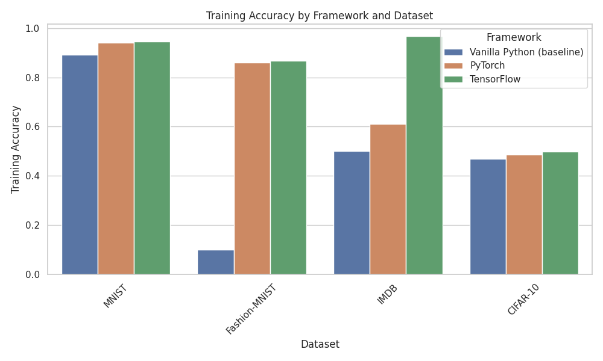
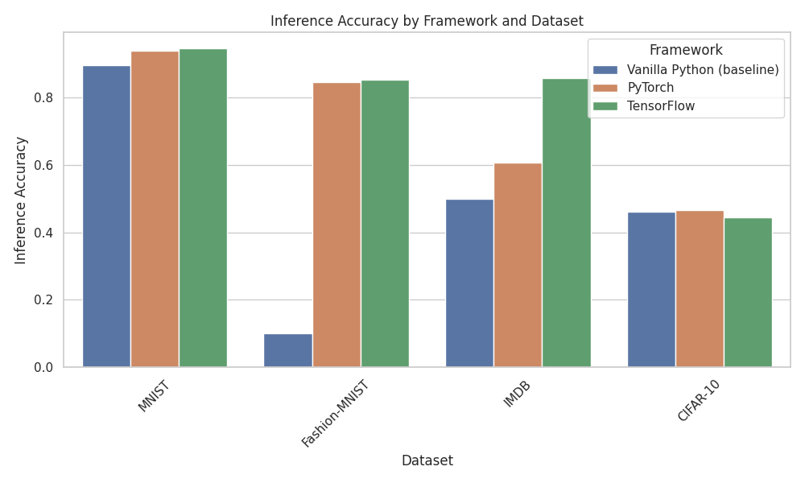
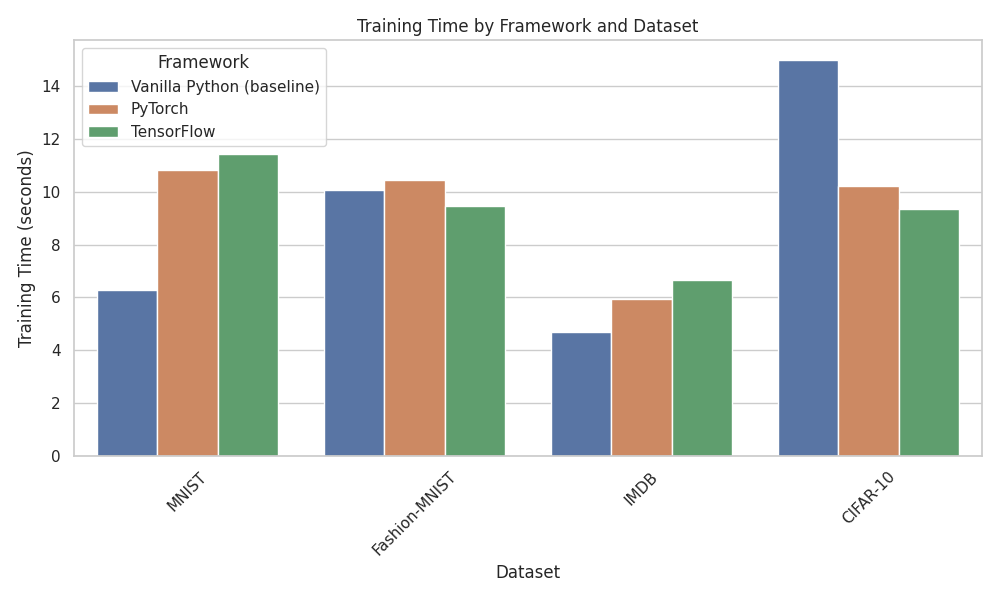
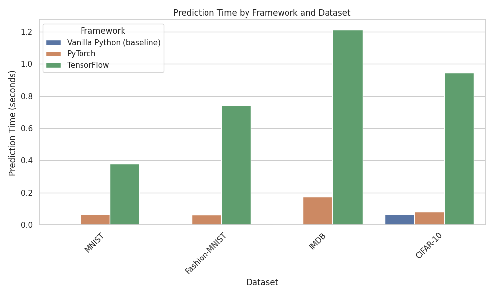

## Summary

This experiment compares the performance of three machine learning frameworks—Vanilla Python (cuPy), PyTorch, and TensorFlow—across four datasets: MNIST, Fashion-MNIST, IMDB Movie Reviews, and CIFAR-10. Key metrics such as training accuracy, inference accuracy, training time, and prediction time are measured and compared to understand the performance differences between the frameworks and datasets.

### Experiment Report

**Experiment Goal**:
- Compare the performance (accuracy, training time, and prediction time) of different machine learning frameworks—Vanilla Python (cuPy), PyTorch, and TensorFlow—on various datasets (MNIST, Fashion-MNIST, IMDB Movie Reviews, and CIFAR-10).

**Project Structure**:
- **Data**: Datasets were preprocessed and loaded from common sources for consistency across frameworks.
- **Models**: Simple feedforward neural networks with similar architectures were implemented for all datasets and frameworks.
- **Metrics**: Training accuracy, inference accuracy, training time, and prediction time were recorded for each experiment and saved to a CSV file (`metrics.csv`).
- **Scripts**: The project contains individual scripts for each framework and dataset, as well as a bash script (`main.sh`) for running the experiments and updating the metrics CSV file automatically.

**Results**:
- **Training Accuracy**: PyTorch and TensorFlow generally performed better than Vanilla Python, with TensorFlow achieving the highest training accuracy across most datasets (except CIFAR-10).
- **Inference Accuracy**: Similar trends were observed for inference accuracy, with TensorFlow performing best on IMDB but showing lower performance on CIFAR-10.
- **Training Time**: Vanilla Python (cuPy) exhibited the fastest training times for MNIST and IMDB, but struggled with larger datasets like CIFAR-10. TensorFlow and PyTorch showed more consistent performance across datasets.
- **Prediction Time**: TensorFlow had the highest prediction times across most datasets, while PyTorch and Vanilla Python showed significantly lower prediction times.

#### Training Accuracy by Framework and Dataset:


#### Inference Accuracy by Framework and Dataset:


#### Training Time by Framework and Dataset:


#### Prediction Time by Framework and Dataset:


**Analysis**:
- TensorFlow consistently achieved better accuracy but was slower in terms of prediction times, especially with larger datasets like IMDB and CIFAR-10.
- PyTorch maintained a good balance between accuracy and speed across all datasets.
- Vanilla Python, using cuPy for GPU acceleration, performed well with simpler datasets like MNIST and IMDB but struggled with more complex datasets like Fashion-MNIST and CIFAR-10.

### Project Highlights
- The results were visualized using bar plots for easy comparison.
- Frameworks like TensorFlow excel in accuracy but sacrifice speed, while frameworks like Vanilla Python (cuPy) can offer faster execution but struggle with accuracy in more complex datasets.
- The overall experiment provides insights into choosing the appropriate framework based on the dataset and performance priorities.


## Installation and Setup

### Requirements

Ensure your system meets the following requirements before installing:

- Python 3.10+
- CUDA Toolkit (if running on a GPU) - Tested with CUDA 11.x or later
- NVIDIA drivers compatible with your CUDA installation
- A virtual environment (recommended)

### Step-by-Step Guide

#### 1. Clone the Repository

First, clone the project repository:

```bash
git clone https://github.com/SaidTogru/NeuroSpeed.git
cd NeuroSpeed
```

#### 2. Set Up a Virtual Environment

It is recommended to use a virtual environment to manage dependencies. You can set it up using `venv` or `virtualenv`:

```bash
# Using venv
python3 -m venv venv

# Activate the virtual environment
source venv/bin/activate  # On macOS/Linux
venv\Scripts\activate  # On Windows
```

#### 3. Install Python Dependencies

Once the virtual environment is activated, install the required Python packages from `requirements.txt`:

```bash
pip install -r requirements.txt
```

If you need GPU support for TensorFlow, PyTorch, or cuPy, ensure that you have the correct version of CUDA and cuDNN installed. Refer to the respective framework's documentation for compatibility:

- [CUDA Toolkit](https://developer.nvidia.com/cuda-toolkit)
- [cuDNN](https://developer.nvidia.com/cudnn)

#### 4. Verify CUDA Installation (Optional for GPU Support)

If you plan to run on a GPU, verify that CUDA is correctly installed by running:

```bash
nvcc --version
```

Also, ensure that your Python environment can detect the GPU. For PyTorch, you can run:

```python
import torch
print(torch.cuda.is_available())
```

For TensorFlow:

```python
import tensorflow as tf
print(tf.config.list_physical_devices('GPU'))
```

#### 5. Download Datasets

The project uses multiple datasets (e.g., MNIST, Fashion-MNIST, CIFAR-10, IMDB) that are automatically downloaded when running the scripts. Ensure you have enough space to store these datasets.

#### 6. Running the Project

Once all the dependencies are installed and datasets are ready, you can run the project by executing the provided bash script, which runs all the models (PyTorch, TensorFlow, Vanilla Python) across various datasets:

```bash
./main.sh
```

This script will train the models and update the `metrics.csv` file with training accuracy, inference accuracy, time taken, and other metrics for each framework and dataset.

Alternatively, you can run each script individually:

```bash
# For PyTorch CIFAR-10 example
python3 training/pytorch_cifar10.py

# For TensorFlow MNIST example
python3 training/tensorflow_mnist.py

# For Vanilla Python IMDB example
python3 training/vanilla_python_imdb.py
```

---

### Troubleshooting

- **CUDA Issues**: Ensure that the correct version of CUDA and cuDNN are installed, matching the versions of PyTorch, TensorFlow, and cuPy you're using.
- **Environment Issues**: If you encounter issues related to packages or dependencies, check the `requirements.txt` to ensure all necessary packages are installed.
